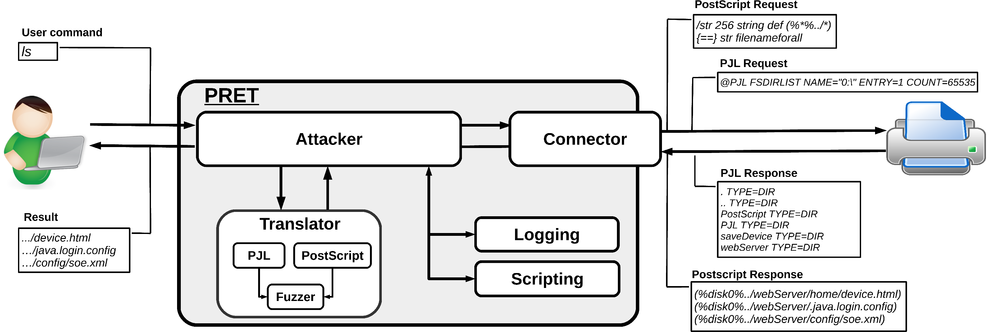

## PRET - Printer Exploitation Toolkit

**Is your printer secure? Check before someone else does...**

PRET is a new tool for printer security testing developed in the scope of a [Master's Thesis](http://nds.rub.de/media/ei/arbeiten/2017/01/13/exploiting-printers.pdf) at Ruhr University Bochum. It connects to a device via network or USB and exploits the features of a given printer language. Currently [PostScript](https://www.adobe.com/products/postscript/pdfs/PLRM.pdf), [PJL](http://h10032.www1.hp.com/ctg/Manual/bpl13208.pdf) and [PCL](http://www.hp.com/ctg/Manual/bpl13210.pdf) are supported which are spoken by most laser printers. This allows cool stuff like capturing or manipulating print jobs, accessing the printer's file system and memory or even causing physical damage to the device. All attacks are documented in detail in the [Hacking Printers Wiki](http://hacking-printers.net/wiki/).

The main idea of PRET is to facilitate the communication between the end-user and the printer. Thus, after entering a UNIX-like command, PRET translates it to PostScript, PJL or PCL, sends it to the printer, evaluates the result and translates it back to a user-friendly format. PRET offers a whole bunch of commands useful for printer attacks and fuzzing.



### Installation

PRET only requires a Python2 interpreter. For colored output and SNMP support however, third party modules need to be installed:

    # pip install colorama pysnmp

If running on a Windows console and Unicode characters are not displayed correctly, install the *win_unicode_console* module:

    # pip install win_unicode_console

For experimental, ‘driverless’ printing (see print command), ImageMagick and GhostScript need to be installed:

    # apt-get install imagemagick ghostscript

### Usage

```
usage: pret.py [-h] [-s] [-q] [-d] [-i file] [-o file] target {ps,pjl,pcl}

positional arguments:
  target                printer device or hostname
  {ps,pjl,pcl}          printing language to abuse

optional arguments:
  -h, --help            show this help message and exit
  -s, --safe            verify if language is supported
  -q, --quiet           suppress warnings and chit-chat
  -d, --debug           enter debug mode (show traffic)
  -i file, --load file  load and run commands from file
  -o file, --log file   log raw data sent to the target
```

###### Example usage:

    $ ./pret.py laserjet.lan ps
    $ ./pret.py /dev/usb/lp0 pjl

###### Positional Arguments:

PRET requires a valid target and a printer language as arguments. The target can either be the IP address/hostname of a network printer (with port 9100/tcp open) or a device like `/dev/usb/lp0` for a local USB printer. To quickly discover all network printers in your subnet using SNMP broadcast, simply run PRET without arguments:

```
./pret.py
No target given, discovering local printers

address          device                       uptime    status                 
───────────────────────────────────────────────────────────────────────────────
192.168.1.5      hp LaserJet 4250             10:21:49   Ready                 
192.168.1.11     HP LaserJet M3027 MFP        13 days    Paper jam             
192.168.1.27     Lexmark X792                 153 days   Ready                 
192.168.1.28     Brother MFC-7860DW           16:31:17   Sleep mode            
```

The printer language to be abused must be one of `ps`, `pjl` or `pcl`. Not all languages are supported by every printer, so you may wan't to switch languages if you don't receive any feedback. Each printer language is mapped to a different set of PRET commands and has different capabilities to exploit.

###### Optional Arguments:

`--safe` tries to check via IPP, HTTP and SNMP if the selected printing language (PS/PJL/PCL) is actually supported by the device before connecting. On non-networked printers (USB, parallel cable) this test will fail.

`--quit` suppresses printer model determination, intro message and some other chit-chat.

`--debug` shows the datastream actually sent to the device and the feedback received. Note that header data and other overhead is filtered. The see the whole traffic, use wireshark. Debugging can also be switched on/off within a PRET session using the `debug` command 

`--load filename` reads and executes PRET commands from a text file. This is usefull for automation. Command files can also be invoked later within a PRET session via the `load` command.

`--log filename` writes a copy of the raw datastream sent to the printer into a file. This can be useful to build a malicious print job file which can be deployed on another printer not directly reachable, for example by printing it from USB drive.

### Generic Commands

After connecting to a printer device, you will see the PRET shell and can execute various commands:

```
$ ./pret.py laserjet.lan pjl
      ________________
    _/_______________/|
   /___________/___//||   PRET | Printer Exploitation Toolkit v0.25
  |===        |----| ||    by Jens Mueller <jens.a.mueller@rub.de>
  |           |   ô| ||
  |___________|   ô| ||
  | ||/.´---.||    | ||        「 cause your device can be
  |-||/_____\||-.  | |´           more fun than paper jams 」
  |_||=L==H==||_|__|/

     (ASCII art by
     Jan Foerster)

Connection to laserjet.lan established
Device:   hp LaserJet 4250

Welcome to the pret shell. Type help or ? to list commands.
laserjet.lan:/> help

Available commands (type help <topic>):
=======================================
append  debug    edit    free  id    ls       open      restart   timeout  
cat     delete   env     fuzz  info  mirror   printenv  selftest  touch    
cd      df       exit    get   load  mkdir    put       set       traversal
chvol   disable  find    help  lock  nvram    pwd       site      unlock   
close   display  format  hold  loop  offline  reset     status    version  

laserjet.lan:/> ls ../../
-      834   .profile
d        -   bin
d        -   dev
d        -   etc
d        -   hp
d        -   hpmnt
-     1276   init
d        -   lib
d        -   pipe
d        -   tmp
laserjet.lan:/> exit
```

A list of generic PRET commands is given below:

```
help      List available commands or get detailed help with 'help cmd'.
debug     Enter debug mode. Use 'hex' for hexdump:  debug [hex]
load      Run commands from file:  load cmd.txt
loop      Run command for multiple arguments:  loop <cmd> <arg1> <arg2> …
open      Connect to remote device:  open <target>
close     Disconnect from device.
timeout   Set connection timeout:  timeout <seconds>
discover  Discover local printer devices via SNMP.
print     Print image file or raw text:  print <file>|"text"
site      Execute custom command on printer:  site <command>
exit      Exit the interpreter.
```

Generic file system operations with a PS/PJL/PCL specific implementation are:

```
┌───────────┬─────┬─────┬─────┬────────────────────────────────────────┐
│ Command   │ PS  │ PJL │ PCL │ Description                            │
├───────────┼─────┼─────┼─────┼────────────────────────────────────────┤
│ ls        │  ✓  │  ✓  │  ✓  │ List contents of remote directory.     │
│ get       │  ✓  │  ✓  │  ✓  │ Receive file: get <file>               │
│ put       │  ✓  │  ✓  │  ✓  │ Send file: put <local file>            │
│ append    │  ✓  │  ✓  │     │ Append to file: append <file> <str>    │
│ delete    │  ✓  │  ✓  │  ✓  │ Delete remote file: delete <file>      │
│ rename    │  ✓  │     │     │ Rename remote file: rename <old> <new> │
│ find      │  ✓  │  ✓  │     │ Recursively list directory contents.   │
│ mirror    │  ✓  │  ✓  │     │ Mirror remote filesystem to local dir. │
│ cat       │  ✓  │  ✓  │  ✓  │ Output remote file to stdout.          │
│ edit      │  ✓  │  ✓  │  ✓  │ Edit remote files with vim.            │
│ touch     │  ✓  │  ✓  │     │ Update file timestamps: touch <file>   │
│ mkdir     │  ✓  │  ✓  │     │ Create remote directory: mkdir <path>  │
├───────────┼─────┼─────┼─────┼────────────────────────────────────────┤
│ cd        │  ✓  │  ✓  │     │ Change remote working directory.       │
│ pwd       │  ✓  │  ✓  │     │ Show working directory on device.      │
│ chvol     │  ✓  │  ✓  │     │ Change remote volume: chvol <volume>   │
│ traversal │  ✓  │  ✓  │     │ Set path traversal: traversal <path>   │
├───────────┼─────┼─────┼─────┼────────────────────────────────────────┤
│ format    │  ✓  │  ✓  │     │ Initialize printer's file system.      │
│ fuzz      │  ✓  │  ✓  │     │ File system fuzzing: fuzz <category>   │
├─ ─ ─ ─ ─ ─┴─ ─ ─┴─ ─ ─┴─ ─ ─┴─ ─ ─ ─ ─ ─ ─ ─ ─ ─ ─ ─ ─ ─ ─ ─ ─ ─ ─ ─ ┤
│   path   - Explore fs structure with path traversal strategies.      │
│   write  - First put/append file, then check for its existence.      │
│   blind  - Read-only tests for existing files like /etc/passwd.      │
├───────────┬─────┬─────┬─────┬────────────────────────────────────────┤
│ df        │  ✓  │  ✓  │     │ Show volume information.               │
│ free      │  ✓  │  ✓  │  ✓  │ Show available memory.                 │
└───────────┴─────┴─────┴─────┴────────────────────────────────────────┘
```

### Commands in PS mode

```
id         Show device information.
version    Show PostScript interpreter version.
devices    Show available I/O devices.
uptime     Show system uptime (might be random).
date       Show printer's system date and time.
pagecount  Show printer's page counter.

lock       Set startjob and system parameters password.
unlock     Unset startjob and system parameters password.
restart    Restart PostScript interpreter.
reset      Reset PostScript settings to factory defaults.
disable    Disable printing functionality.
destroy    Cause physical damage to printer's NVRAM.
hang       Execute PostScript infinite loop.

overlay    Put overlay eps file on all hardcopies:  overlay <file.eps>
cross      Put printer graffiti on all hardcopies:  cross <font> <text>
replace    Replace string in documents to be printed:  replace <old> <new>
capture    Capture further jobs to be printed on this device.
hold       Enable job retention.

set        Set key to value in topmost dictionary:  set <key=value>
known      List supported PostScript operators:  known <operator>
search     Search all dictionaries by key:  search <key>
dicts      Return a list of dictionaries and their permissions.
resource   List or dump PostScript resource:  resource <category> [dump]

dump       Dump dictionary:  dump <dict>
  Dictionaries: - systemdict - statusdict - userdict 
                - globaldict - serverdict - errordict
                - internaldict - currentsystemparams
                - currentuserparams - currentpagedevice

config     Change printer settings:  config <setting>
  duplex        - Set duplex printing.
  copies #      - Set number of copies.
  economode     - Set economic mode.
  negative      - Set negative print.
  mirror        - Set mirror inversion.
```

Not all commands are supported by every printer. Especially Brother and Kyocera devices use their own PostScript clones – Br-Script and KPDL – instead of licensing original ‘Adobe PostScript’. Such flavours of the PostScript language may not be 100% compatible, especially concerning security sensitive features like capturing print jobs. Access to the file system is supported by most printers, however usually limited to a certain, sandboxed directory.

### Commands in PJL mode

```
id         Show device information.
status     Enable status messages.
version    Show firmware version or serial number (from 'info config').
pagecount  Manipulate printer's page counter:  pagecount <number>
printenv   Show printer environment variable:  printenv <VAR>
env        Show environment variables (alias for 'info variables').
set        Set printer environment variable:  set <VAR=VALUE>

display    Set printer's display message:  display <message>
offline    Take printer offline and display message:  offline <message>
restart    Restart printer.
reset      Reset to factory defaults.
selftest   Perform various printer self-tests.
disable    Disable printing functionality.
destroy    Cause physical damage to printer's NVRAM.
flood      Flood user input, may reveal buffer overflows.

lock       Lock control panel settings and disk write access.
unlock     Unlock control panel settings and disk write access.
hold       Enable job retention.

nvram      NVRAM operations:  nvram <operation>
  nvram dump [all]           - Dump (all) NVRAM to local file.
  nvram read addr            - Read single byte from address.
  nvram write addr value     - Write single byte to address.

info       Show information:  info <category>
  info config      - Provides configuration information.
  info filesys     - Returns PJL file system information.
  info id          - Provides the printer model number.
  info memory      - Identifies amount of memory available.
  info pagecount   - Returns the number of pages printed.
  info status      - Provides the current printer status.
  info ustatus     - Lists the unsolicited status variables.
  info variables   - Lists printer's environment variables.
```

Some commands are supported exclusively by HP printers, because other vendors have only implemented a subset of the PJL standard. This is especially true for PML based commands like `restart`or `reset`. Enabling long-term job retention via the `hold` command seems to be possible for some Epson devices only. NVRAM access via the `nvram` command is a proprietary feature of Brother printers. Limited access to the file system is supported by various HP, OKI, Konica, Xerox, Epson and Ricoh devices.

### Commands in PCL mode

```
selftest   Perform printer self-test.
info       Show information:  info <category>
  info fonts      - Show installed fonts.
  info macros     - Show installed macros.
  info patterns   - Show user-defined patterns.
  info symbols    - Show symbol sets.
  info extended   - Show extended fonts.
```

PCL is a very limited page description language without access to the file system. The `get`/`put`/`ls` commands therefore use a virtual file system based on PCL macros, implemented mostly for the hack value. This proof-of-concept shows that even a device which supports only minimalist languages like PCL can be used to store arbitrary files like copyright infringing material. Although such a file sharing service is not a security vulnerability per se, it might apply as ‘misuse of service’ depending on the corporate policy

### File Listing

- `pret.py` - Executable main program
- `capabilities.py` - Routines to check for printer langauge support
- `discovery.py` - Routines to list printers using SNMP broadcast
- `printer.py` - Generic code to describe a printing device
- `postscript.py` - PS spezific code (inherits from class printer)
- `pjl.py` - PJL spezific code (inherits from class printer)
- `pcl.py` - PCL spezific code (inherits from class printer)
- `helper.py` - Help functions for output, logging, sockets, etc.
- `codebook.py` - Static table of PJL status/error codes
- `fuzzer.py` - Constants for file system fuzzing
- `mibs/*` - Printer specific SNMP MIBs
- `db/*` - database of supported models
- `lpd/*` - Scripts for LPD fuzzing

### Getting Started

Given the features and various proprietary extensions in printing languages like PostScript and PJL, conducting a pentest on printers is not a trivial job. PRET can help to assist and verify known issues in the language. Once you have played around with the tool, you may want to perform a systematic printer security analysis. A good starting point is the [Printer Security Testing Cheat Sheet](http://hacking-printers.net/wiki/index.php?title=Printer_Security_Testing_Cheat_Sheet).

**Happy Hacking!**
